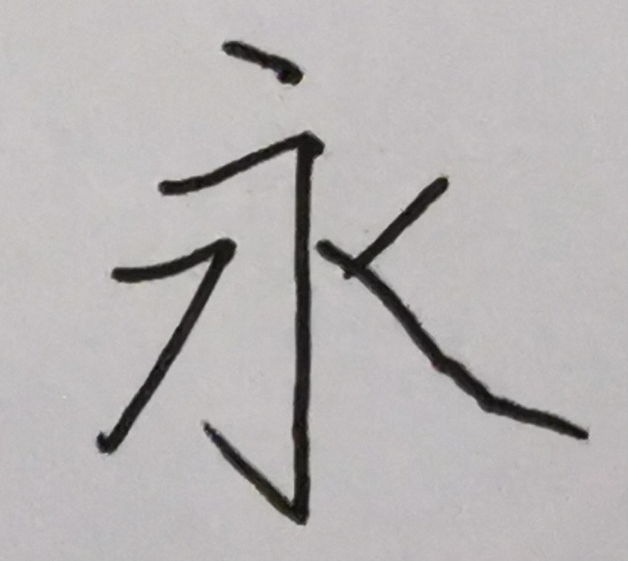
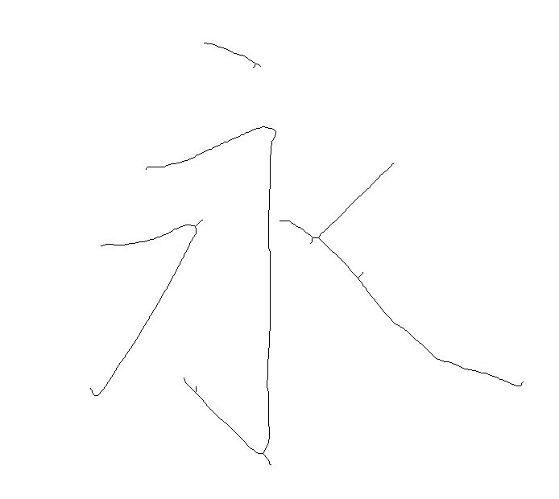
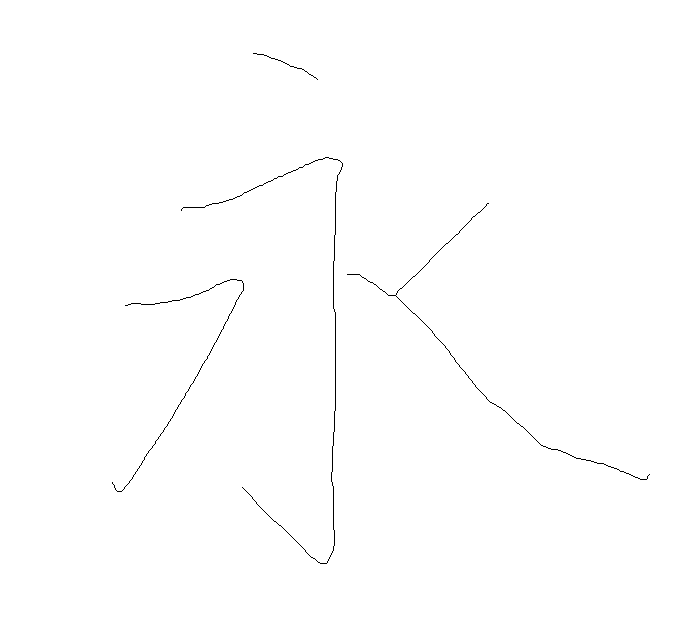
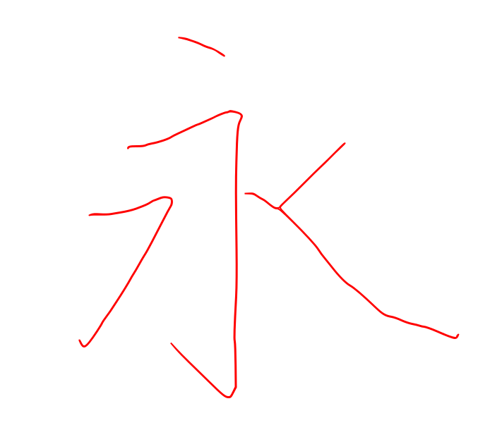
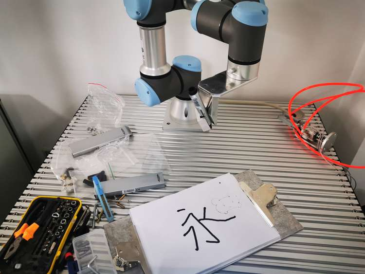
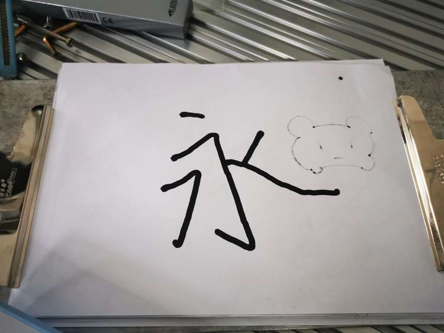

# RobotWriteWord
此为SRT项目，实现根据人类手写汉字，使用机械臂复写汉字，2021年3月初结束

### 项目目的

+ 完成将相机拍摄的人类手写汉字图像；
+ 通过halcon处理为**骨架**图片；
+ 再将其剪枝、转换为**矢量图**；
+ 最后使用**UR3机械臂**抓握笔将其复写出。

### 目录结构

+ `libpotrace/`为potrace库，将位图转换为矢量图
+ `Write/`为剪枝和转换矢量图，
  + `skeleton.cpp`为main入口
  + `data/`为输入输出结果

### 效果展示

+ 手写原图：

+ 骨架提取图

+ 剪枝修复结果图

+ 拟合矢量图

+ 机械臂复写图

